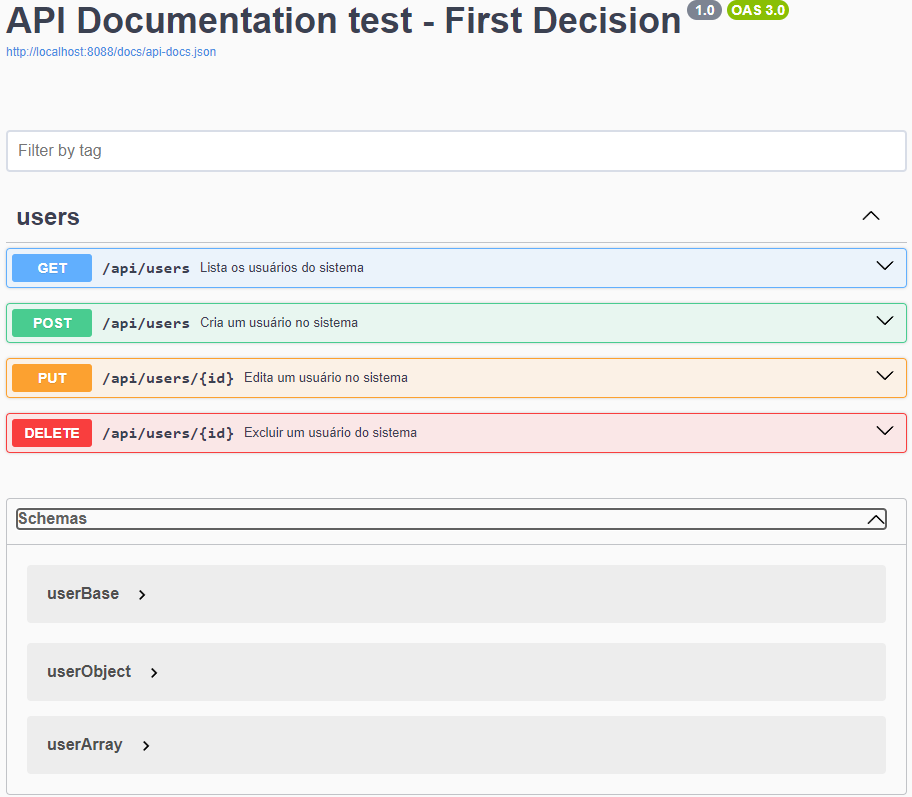
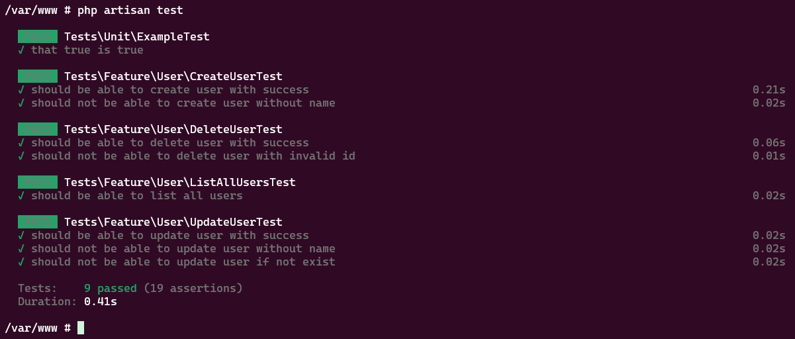

# Projeto para teste - First Decision PHP/Laravel API REST

Este repositório contém uma API desenvolvida em Laravel para gerenciamento de usuários. A API inclui operações de CRUD (Create, Read, Update, Delete) e foi criada utilizando boas práticas de desenvolvimento e testes.

Este projeto segue as melhores práticas de design e arquitetura de software, aplicando SOLID, clean code, calistenia de objetos, entre outros conceitos e patterns conhecidos.

O projeto utiliza um padrão de design com Services e Repositories para abstrair a lógica de negócios e a camada de acesso a dados. Além disso, conta com FormRequest, Resource, Contacts/Interfaces e testes unitários e de feature.

Adicionei uma regra, para fins de demonstração de onde a regra é implementada na cada Services. A regra por si só não tem tanto sentido operacional, porém era apenas para demonstrra o uso da regra do negócio no código: Ao editar um usuário e optar por alterar a senha dele, deve-se informar a senha atual e a nova senha (em casos reais, essa regra seria válida caso o usuário estivesse alterando sua própria senha de autenticação), onde o back-end verifica se a senha atual digitada realmente é a senha cadastrada no banco de dados.

Além disso, foi criado um CI pelo github actions para que, quando tenha um merge/commit na branch main, seja executado o CI e executado os testes unitários da aplicação.

## Tecnologias Utilizadas

- **Laravel**: Framework PHP para construção de aplicações web.
- **PHP**: Linguagem de programação utilizada versão 8.3.
- **Docker**: Ferramenta de contêinerização.
- **PostgreSQL**: Banco de dados utilizado.

## Pré-requisitos

- Docker
- Docker Compose


## Estrutura do Projeto

O projeto se encontra dentro da pasta `src`, foi feito desta maneira para sepagar o Docker (infra) da aplicação. Dentro do diretório App, o projeto inclui:

-   **Services**: Contém a lógica de negócios e as regras da aplicação.
-   **Repositories**: Fornece uma camada de abstração sobre o acesso a dados, permitindo uma maneira mais flexível de interagir com o banco de dados. Também, existe no diretório os contracts (interfaces).
-   **Config**: Diretório para arquivos de configuração da aplicação.

## Configuração e Instalação

A seguir, passo a passo para rodar o sistema em ambiente local.

### Pré-requisitos

Instruções para configurar e instalar o projeto:

-   Docker configurado no sistema operacional

-   Fazer uma cópia do .env.exemple para .env

### Instalação

Clone o repositório:

```
    git clone https://github.com/julioolver/first-decision-api-test.git
    cd first-decision-api-test
```

Para emular o ambiente de desenvolvimento, foi utilizado o Docker e Docker-compose.

Rodar dentro da raiz do repositório (não precisa acessar a pasta src, no docker já deixei mapeado a pasta src para subir a aplicação)

```
docker-compose up --build -d
```

Caso seja necessário instalar as dependências novamente:

```
 docker exec -it laravel-app sh
```

```
 composer install
```
Após isso, o sistema se torna acessível via:

`http://localhost:8088`

## Rodar documentação da API

Para o projeto, foi realizada a documentação das rotas com o Swagger UI.

Acesse a seguinte URL para ter acesso a documentação:

`http://localhost:8088/api/documentation/`



## Rodando os testes

Para rodar os testes criados, basta executar:

```
 docker exec -it laravel-app sh
```

```
php artisan test
```


## Front-end

Por se tratar de uma API REST, o Front-end foi desenvolvido em outro repositório, separando a responsabilidade de ambos:

[Github front-End](https://github.com/julioolver/first-decision-front-end-test)


## TODO

Deixo anotado aqui, com um TODO para ser feito ainda dentro deste projeto:

-   Adicionar no Swagger para documentação os erros que a API poderá retornar

## Autores

-   **Julio Cesar Oliveira da Silva**
